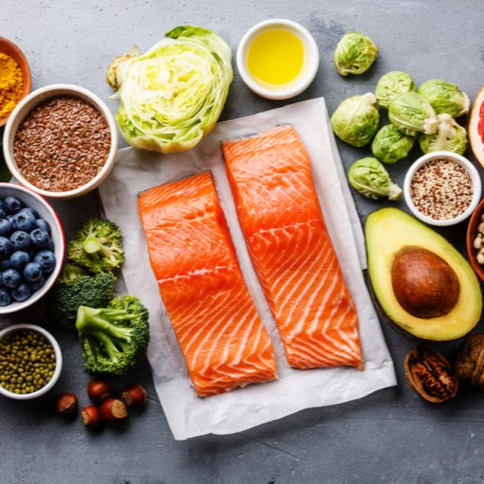

Allergy Safe Recipe Search App is an application to assist those suffering with food allergies to find recipes and search through them for any potential harmful ingredients.  Users can search through recipes and save recipes to a favorites section for later viewing.  At some point I will also implement a harmful ingredients function as well.

<pre>
Imagine having to change your entire diet due to a food allergy.  You can no longer eat the foods you are used to without paying very serious consequences.  What do you do?  It's not worth playing the guessing game when it comes to your health.  The Allergy Safe Recipe Search App can make life so much easier by allowing users to find safe recipes to eat and save for future use as well.
